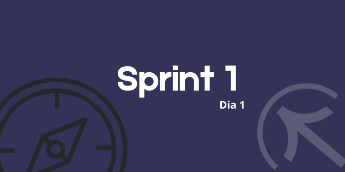

# Sprints

# Sprint 1
## Dia 1 Ágil

Esse é um arquivo com meus estudos sobre o primeiro dia Sprint 1 na minha bolsa na [Compass.UOL](https://compass.uol/en/about-us/)

# Assuntos abordados

## Organização
Uma boa organização é fundamental para o sucesso de qualquer trabalho, lembrando sempre que internet é uma grande ferramenta e cabe a nós usá-la com sabedoria.

### Feramentas
- [Miro](https://miro.com/pt/)
- [Gitlab](https://about.gitlab.com/)
- (Outras ferramentas na web de seu gosto)

### Conceitos
- Matriz de Eisenhower

## Git e Gitlab
[Git](https://git-scm.com/) é essencial para salvar e ter o controle de seus códigos, além de permitir acessar o histórico de adição, criar branches, e permitir que inúmeros programadores trabalhem em cima de um mesmo código. Para permitir o armazenamento, compartilhamento e outras funções é fundamental o uso do [Gitlab](https://about.gitlab.com/).

## ReadMe
Arquivos Markdown nomeados de "ReadMe" são um consenso na comunidade de desenvolvimento, pois nele estão guardadas informações relevantes do projeto como licenças, explicações sobre ferramentas usadas no projeto, como usar o projeto, qual o objetivo dele, entre outros. Fazer um bom ReadMe é fundamental para o entendimento de projetos por outros desenvolvedores ou por pessoas que não tem conhecimento na área.

