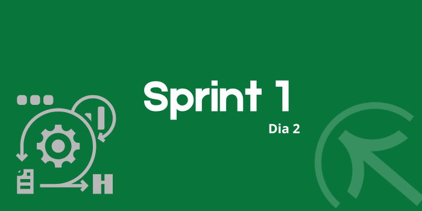
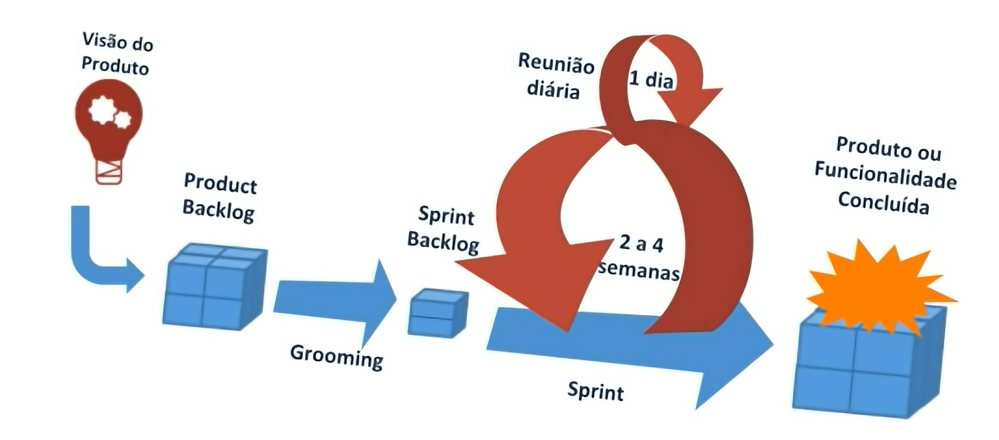

# Sprint 1
## Dia 2 Ágil

Esse é um arquivo com meus estudos sobre o segundo dia Sprint 1 na minha bolsa na [Compass.UOL](https://compass.uol/en/about-us/)

# Assuntos abordados

## Comunicação em Equipe
Em qualquer trabalho é fundamental a comunicação, afinal ela garante que o fluxo de informações ocorra de maneira correta, assim evitando ruídos que causam retrabalho, conflitos, mal entendidos que atrasam e impedem que a meta se desenvolva.

### Itens importantes
* Respeito;
* Ter transparência e clareza;
* Ter feedbacks, de todos, desenvolvedores, clientes, chefes e especialistas;
* Não ter medo de questionar, não importando a hierarquia;
* Buscar informações para aumentar seu repertório nas conversas;
* Saber o momento de descontração.

## Scrum
O Scrum é um framework extremamente útil para o desenvolvimento de software, mas ele pode ser usado em diversas outras áreas, pois ele funciona independente do tema ou área, produto ou serviço.
Uma das principais ideias do Scrum é que apenas as pessoas que estão diretamente envolvidas no projeto têm o real conhecimento da quantidade de esforço que é necessária para cada entrega ao final da Sprint.

### 3 pilares do Scrum
* Transparência
Passar as informações não escondendo erros ou dúvidas, repassar as informações relevantes para que o time possa prosseguir com seu trabalho sem dúvidas

* inspeção
Ter um controle do projeto a todo momento é fundamental para encontrar problemas e corrigi-los antes que eles afetem o projeto de forma drástica

* Adaptação
O projeto deve ser flexível para que possa se moldar ao projeto e a equipe, assim ele pode se adaptar ao andamento do projeto

### Valores do Scrum

Compromisso, Foco, Abertura, Respeito e Coragem.

> ### Scrum Team
> A adaptação se torna mais difícil quando as pessoas envolvidas não são empoderadas ou
> Auto-gerenciadas. Espera-se que um Scrum Team se adapte no momento em que aprende
> Algo novo por meio da inspeção.

>> ### Product Owner
>> Ele é responsável pelo produto, ele gerencia o Product Backlog, além de comunicar os itens e incrementos que estão nele, todas as decisões sobre o Product Backlog passam por ele.

>>> ### Scrum Master
>>> Ele é responsável pelo Scrum, suas técnicas e pela eficácia do mesmo. Ele treina e dá engajamento para o time, ele planeja e ajuda tanto o Product Owner como o Dev Team.

>>> ### Dev Team ou Developers
>>> São os responsáveis por criar os incrementos para o produto final, eles seguem a Sprint, além de criar um plano para a Sprint, o Sprint Backlog. Eles são auto gerenciáveis, ou seja, o time decide como chegar ao seu objetivo.

### Eventos Scrum
O Scrum tem a ideia de dividir algo complexo em pequenas tarefas chamadas de Sprints, essas duram de em torno de 2 semanas ou 1 mês, o ideal é esse tempo para o time não perder o foco da Sprint.

> ### Sprint
> Uma nova Sprint começa imediatamente após a conclusão da Sprint anterior. Ela é o período onde se trabalha, planeja e analisa o trabalho e metas.

>> ### Sprint Planning
>> É onde e define o que vai ser feito na Sprint, este plano é criado pelo Scrum Team (Pode se chamar outras pessoas para fornecer conselhos)
>> Uma Sprint Planning não acaba até que esse 3 tópicos sejam respondidos:
>> 1. Por que está Sprint é valiosa?
>> 2. O que pode ser feito nesta Sprint?
>> 3. Como o trabalho escolhido será realizado?

>> ### Daily Scrum
>> São reuniões onde se conversa sobre o progresso, impedimentos e tarefas de uma sprint, elas acontecem diariamente e tem  duração de em torno de 15 minutos. As Dailys ajudam na comunicação e permitem perceber problemas a tempo de corrigi-los e adaptar o planejamento do produto. Mas não são as únicas reuniões que o Team Scrum deve fazer para falar sobre o produto e a Sprint.
>> perguntas que se fazem em uma Daily:
>> 1. O que fez ontem?
>> 2. O que vai fazer hoje?
>> 3. Tem algum impedimento?

>> ### Sprint Review
>> É a apresentação dos incrementos e progressos de uma Sprint, a assim ajustar o Product Backlog. O Scrum Team deve evitar limitá-la
a uma apresentação.

>> ### Sprint Retrospective
>> É parecida com a Sprint review, porém esta foca na maneira que o trabalho foi realizado e não no trabalho em si, assim se pode identificar problemas na hora do desenvolvimento e como melhorá-lo.

### Scrum Artifacts

### Product Backlog
O Product Backlog é uma lista ordenada e emergente do que é necessário para melhorar o produto. É a única fonte de trabalho realizado pelo Scrum Team. Os itens e Incrementos estão nele, sua totalidade é o produto final.

### Meta do Produto
O objetivo da Sprint.

### Incrementos
São o que será trabalhado em uma Sprint.

### Definição de Pronto
Sua importância deve para que todos tenham um consenso de quando algo está devidamente terminado. Se um item do Product Backlog não
atender à Definição de Pronto, ele não poderá ser liberado ou mesmo apresentado na Sprint
Review. Em vez disso, ele retorna ao Product Backlog para consideração futura.

### Sprint Backlog
É composto por uma série de itens do Product Backlog e pela meta da Sprint, é um plano feito por e para os Developers.

## Manifesto Ágil
O [Manifesto Ágil](https://agilemanifesto.org/iso/ptbr/manifesto.html) Foi um encontro de 17 desenvolvedores tentando achar uma maneira melhor para realizar seus projetos e trabalhos. assim eles criaram o manifesto agil (Disponivel em https://agilemanifesto.org)

### Os 12 princípios ágeis

1. Satisfação do cliente;
2. Mudança em favor da vantagem competitidade;
3. Prazos curtos;
4. Trabalho em conjunto;
5. Ambientação e suporte;
6. Falar na cara;
7. Funcionalidade;
8. Ambiente de sustentabilidade;
9. Padrões altos de tecnologia e design;
10. Simplicidade;
11. Autonomia;
12. Reflexões para otimizações.

## Os 4 valores do Manifesto Ágil

1. Indivíduos e interações acima de processos e ferramentas;
2. Software funcionando é melhor que documentação abrangente;
3. Colaboração com o cliente acima de negociação de contratos;
4. Responder a mudanças ao invés de seguir um plano.

