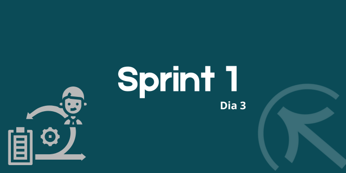
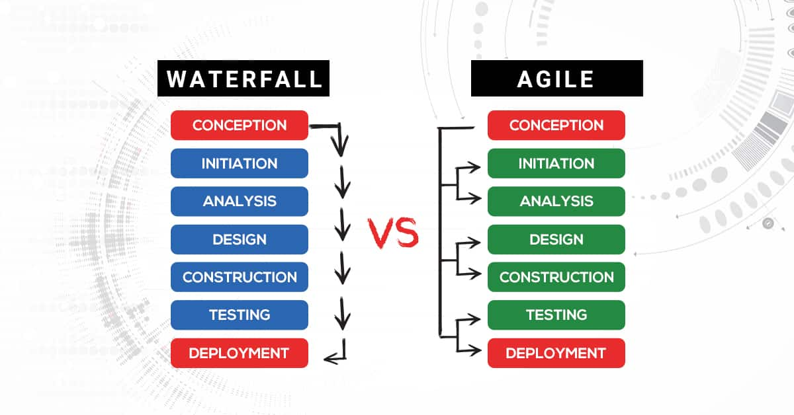

# Sprint 1
## Dia 3 MasterClass

Esse é um arquivo com meus estudos sobre o terceiro dia Sprint 1 na minha bolsa na [Compass.UOL](https://compass.uol/en/about-us/)

# Assuntos abordados

## Scrum
### Desenvolvedores
Autogerenciável, eles determinam a melhor forma ou maneira para realizar o trabalho.
Responsabilidades:

- Estimar o itens do back logo do produto;
- Realizar as atividades sobre o incremento do produto;
- Analisar e gerenciar o backlog.

### Product Owner (PO)
- Estabelecer a visão do produto;
- Trazer a transparência ao backlog;
- Feedbacks;
- Fazer o planejamento do backlog e das realizes;
- Decidir quando um incremento está pronto para ser liberado.

### Scrum Master
Ele é o líder responsável pelo time scrum.
- Melhorar o time scrum;
- Treinamento, ajudar com conselhos, dar uma visão para a meta;
- Auxilia o PO, Scrum Team e a organização.

## Framework Scrum
Fazer entregas incrementais, assim o cliente e o PO podem gerir auxiliar a analisar todo o processo de produção.
ser ágil é trazer o cliente e o PO para proximo do projeto, além de evitar erros dá a sensação responsabilidade a ambos os lados
entregas partes funcionais para terem valor.

## QA em um Time Ágil
No ambiente ágil, essa visão muda e o time consegue transitar por cada etapa do processo sem a necessidade de dependência, a interface ágil é muito importante pois permite pensar no todo e ao mesmo tempo no individual, assim ver como o um afeta o todo.

Definição de ponto é quando o time e o PO tem o consenso de que alto está pronto, assim mais de um time pode entrar em consenso de quando uma tarefa deve ser terminada e implementada.

Ser ágil não é terminar o mais rápido possível, mas sim ser flexível para mudanças e ter um ritmo conciso.

## Epic, Feature and Story
Esse método funciona com o Scrum, nele o product backlog é separado em Epics, Feature e Stories, esses tem um nível de hierarquia sendo eles:

> # Epic
> Uma grande parte do projeto formado por inúmeras funcionalidades e histórias.

>> # Feature
>> São funcionalidades ou características únicas de um programa, essas são formadas por histórias.

>>> # Story
>>> É a necessidade que uma função precisa.

Assim vemos que um épico é formado por várias funcionalidades que são formadas por várias histórias. É recomendado apresentar o que já se tem uma base em uma Sprint Review, pois assim o cliente ou o PO tem mais interesse no projeto.
