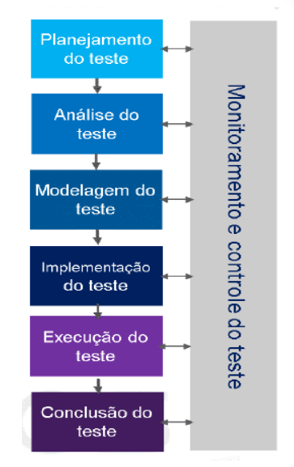

# Sprint 1
## Dia 4 MasterClass

Esse é um arquivo com meus estudos sobre o quarto dia Sprint 1 na minha bolsa na [Compass.UOL](https://compass.uol/en/about-us/)

# Assuntos abordados

## Fundamentos do Teste
## 1. Como Gerar Qualidade
### COMO GERAR QUALIDADE NO PRODUTO?
A qualidade é um conjunto de ações e características que devem ser aplicadas ao produto, não se limitando apenas a testar suas funções, mas sim fazer uma análise completa sobre ele. Essa avaliação consiste em analisar o planejamento, a funcionalidade, reportar defeitos e determinar que esse produto satisfaz  os requisitos e as especificações do cliente e da equipe.

### ESTÁTICO VS DIN MICO
Os teste estáticos normalmentes tem um custo mais baixo, ele se refere a uma análise mais focada na construção e estruturação de um software, como analisar sua programação, sua segurança, arquitetura, requisitos entre outros

Os testes dinâmicos normalmente tem um custo mais alto pois envolvem testes com o produto rodando, nelas são usadas entradas e saídas de dados como o tempo de resposta, a performance, o comportamento funcional entre outros.

### TESTE E DEPURAÇÃO

> ### Teste (Testador)
> Mostra falhas.
>> ### Depuração do código ( Testador para o desenvolvedor)
>> Localização desses erros e a identificação da causa deles. O testador passa esse relatório para o desenvolvedor, no qual deve corrigir o problema e encaminhar o novo código para o testador.
>>> ### Teste de Confirmação (Testador)
>>> Teste sobre o problema já corrigido para garantir que o problema foi consertado.

### EFICIÊNCIA X EFICÁCIA

O objetivo é ser eficiente, ou seja, fazer as tarefas de maneira correta, e ser eficaz, ou seja, que o resultado seja desejável.

### TESTE = QUALIDADE?

O teste é a ponte para  qualidade pois ele traz mudanças fundamentais para o software, assim podendo melhorar e diminuir os retrabalhos e custos adicionais no projeto. A fase de testes não deve ser ignorada.

### ERRO, DEFEITO E FALHA

### ERRO
É um problema causado por uma ação humana, esse erro por menos que seja pode causar defeitos e falhas.

### DEFEITO
É uma inconsistência no produto ela é causa de um ou mais erros.

### FALHA
Uma falha é quando o software, ou  seja ele não é funcional. (um programa pode ter vários defeitos mas ser funcional, independente disso esses erros, defeitos e falhas devem ser corrigidos)

**Deve-se ter um cuidado com falsos positivos e falsos negativos, um ***falso positivo**** é um ***erro*** que aconteceu no teste e indicou um problema que ***não existe na aplicação***, um ***falso negativo*** é um ***erro*** que aconteceu no teste e não indicou um problema que ***existe na aplicação***.*

## Os Sete Princípios do Teste

### 1. O teste mostra a presença de defeitos
Um software sempre tem defeitos ou algo a ser melhorado ou otimizado, os testes mostram esses defeitos, além de que mesmo que não sejam encontrados defeitos, isso não é prova de que eles não existem.

### 2. Testes exaustivos são impossíveis
Os testes apesar de serem importantes gastam tempo e recursos, em função disso deve-se evitar testes desnecessários. Fazer testes em conjuntos é uma boa prática para testar mais de uma função por vez.

### 3. O teste inicial economiza tempo e dinheiro
Garantir que o projeto se desenvolve no caminho certo é muito importante para evitar retrabalhos, por causa disso testes iniciais comprovam o que o caminho a ser seguido está certo, e assim não acarretando em problemas futuros.

### 4. Defeitos se agrupam
Como vimos "ERRO, DEFEITO E FALHA" um acarreta no outro, afinal em um programa tudo está conectado. Pelo princípio de pareto 20% das causas são responsáveis por 80% dos efeitos.

### 5. Cuidado com o paradoxo do pesticida
Um teste deve sempre ser otimizado e melhorado à medida que se é usado, pois se sempre for  executado da mesma forma há a chance de se não achar novos defeitos.

### 6. O teste depende do contexto
Os projetos são únicos, então os testes devem ser únicos para eles, afinal não se testa um carro da mesma maneira que se testa uma bicicleta.

### 7. Ausência de erros é uma ilusão
Apesar de um sistema ser funcional não quer dizer que ele agrade ou que seu propósito esteja comprido.

## Fatores Contextuais
O contexto é muito importante, o Teste deve analisar quais são fatores que influenciam o projeto e trabalhar com eles, assim respeitando o ciclo de vida do desenvolvimento.

## Atividades de Teste
As atividades do testes devem ser interligadas, afinal uma depende e influencia a outra.

### 1. Planejamento do teste
Define o cronograma, exceções, recursos necessários e todo o detalhamento dos testes.

### Análise do teste
A análise do teste é feita em cima do planejamento, nela se analisa as condições do teste.

### Modelagem do teste
Elaborar os casos de testes, isso deve ser feito com base na Análise do teste e Planejamento do teste. Assim oteste acaba tendo forma como seus objetivos, os resultados esperados, as condições, entre outros.

### Implementação do teste
É a preparação para executar o teste, aqui se criam as suítes, os Scripts, o controle de dados entre outros.

### Execução do teste
Com todas as etapas anteriores prontas é a hora de colocar o teste em ação, seguindo o cronograma dos testes e guardando as informações e resultados a cada momento, com isso é feita uma comparação e análise dos resultados para definir o que está correto e o que está errado (Sempre tomando cuidado com falsos positivos e falsos negativos.) Todos os resultados devem ser guardados e registrados assim são criados os status dos casos de teste, relatórios de defeitos, relatórios diários, métricas consolidadas de encerramento dos testes.
Executar Teste de confirmação e teste de regressão.

### Conclusão do teste
Com todas as etapas feitas e os testes executados, e seus problemas corrigidos é concluído as atividades de testes, assim com os resultados obtidos devem ser analisados para melhorar os processos futuros.

## A Psicologia do Teste
Como a comunicação e o respeito são fundamentais em qualquer trabalho, aqui não é diferente, as relações entre desenvolvedores e testadores devem ser claras e fundadas no respeito, saber falar e ouvir são essenciais para a troca de informações em uma equipe, assim tanto os desenvolvedores e testadores aprendem no processo, e o resultado dessa relação é um produto funcional que agrade o cliente e cumpra seu propósito livrem de erros, defeitos e falhas.

