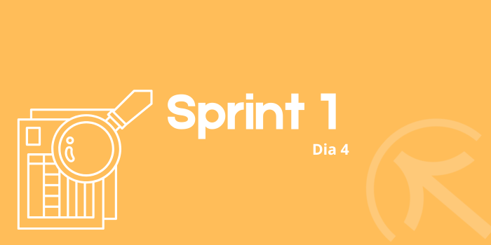

# Sprint 1
## Dia 5 MasterClass

Esse é um arquivo com meus estudos sobre o quinto dia Sprint 1 na minha bolsa na [Compass.UOL](https://compass.uol/en/about-us/)

# Assuntos abordados

## Pirâmide de testes
e2e testes do pondo de vista do usuario, tambem pode conter api ou outros clientes, mas é quem vai interagie de formar frontal, nãp back end. 

teste de unidade objetos falsos tipo um codigo que soma a idade do cara com a da esposa
inves de ter outro codigo para pegar as idades a gente ja deixa elas prontras e testa apenas o que importa o codigo de soma.

