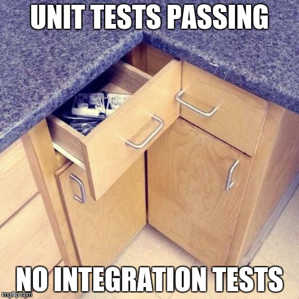
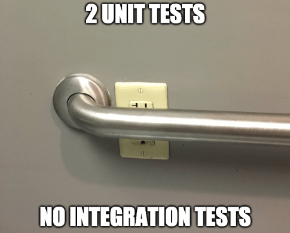

# Sprint 1
## Dia 5 MasterClass

Esse é um arquivo com meus estudos sobre o quinto dia Sprint 1 na minha bolsa na [Compass.UOL](https://compass.uol/en/about-us/)

# Assuntos abordados

## Pirâmide de testes
A pirâmide de testes foi criada por Mike Cohn, separa os testes em 3 grupos, os E2E, Integração, Unidade. esses grupos são colocados em uma pirâmide para representar diversas relações entre eles, podemos ver que os testes de unidades acontecem de maneira mais rápida e são feitas de maneira mais isolada, enquanto os testes E2E são mais lentos e tem mais integração. Essas diferenças também tem a ver com o custo, quanto mais alto na pirâmide mais alto é a dificuldade e o custo.

                                ^  
        + Integração|          / \          | + Devagar  
                    |         /   \         |  
                    |        / E2E \        |  
                    |       /_______\       |  
                    |      /         \      |  
                    |     /           \     |  
                    |    / Integration \    |  
                    |   /_______________\   |  
        + Isolamento|  /      Unit       \  | + Rápido  
                    | /___________________\ |  

### Teste de Unidade

São teste que se aplicam a partes pequenas partes funcionais do software

### Teste de integração
Testa a relação entre funcionalidades e partes da aplicação, lembrando que que duas funcionalidades podem funcionar perfeitamente, porém a integração dela nem tanto.

### E2E
Testes de ponta a ponta, normalmente pela vista do usuário, mas também pode conter APIs ou outros clientes. Esses testes passam por todos os processos possíveis a fim de testar a aplicação de maneira geral, esses testes são mais difíceis de serem feitos, além de mais lentos.

