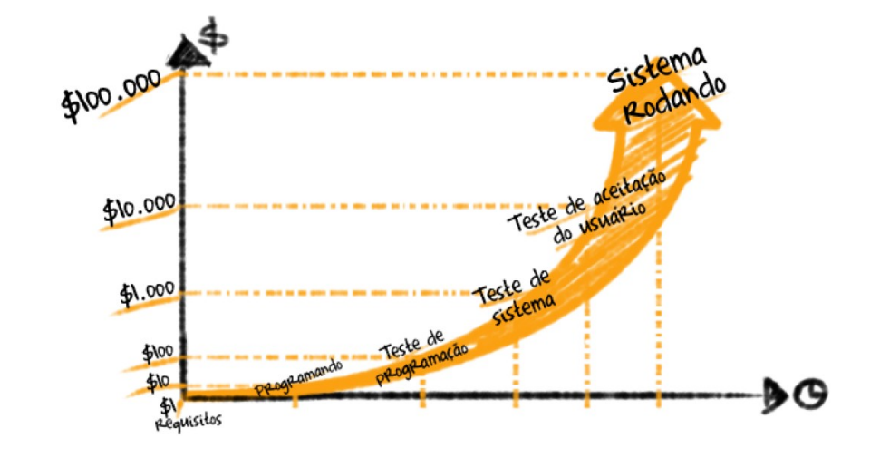

# Sprint 1
## Dia 6 MasterClass

Esse é um arquivo com meus estudos sobre o sexto dia Sprint 1 na minha bolsa na [Compass.UOL](https://compass.uol/en/about-us/)

# Assuntos abordados

## regra 10 Myers
Os testes devem andar junto com o desenvolvimento, quanto antes melhor, afinal é mais facil achar, consertar um erro no inicio do que  no final, alem do custo ser menor.

É melhor resolver 100.000 problemas de $1 do que 1 problema de $100.000.

Os testes previnem que muitos erros aconteçam, esses erros podem causar falhas de segurança que podem trazer  problemas extremamente grandes, que custam a confiança e o dinheiro do cliente.

segundo o [Curso de Treinamento Específico para Programadores](https://www.pjf.mg.gov.br/secretarias/sarh/edital/interno/selecao2015/arquivos/apostilas/modulo4_p.pdf)
"Conforme afirmado em vários relatos de experiência e já
percebido no mercado, os reais benefícios são a redução em 70%
do índice de retrabalho na correção de falhas em produção,
redução em 50% do tempo de homologação de uma nova versão.
Além disso, aumenta em aproximadamente 90% o índice de falhas
detectadas antes da produção onde o custo é bem mais baixo [...]"

Os testes têm seu papel fundamental no desenvolvimento de software, além de identificar erros ele melhora a qualidade aumenta a confiança dos clientes reduz futuros gastos entre outros.

## o grau de independência

Os graus de independência servem para  evitar a influência dos autores nos testes, porém eles não devem ser excluídos dos testes, pois eles possuem noções que podem ser úteis para elaborar testes eficientes.

> Teste elaborado por pessoa(s) de diferentes organizações ou empresas (terceirizada ou certificada por um órgão externo).
>> Teste elaborado por pessoa(s) de um grupo organizacional diferente.
>>> Teste elaborado por outra(s) pessoa(s).
>>>> Teste elaborado por quem escreveu o software.

A comunicação entre os testadores e os desenvolvedores devem ser transparentes e respeitosos, para não gerar constrangimento e nem outras emoções negativas.

## Processo de Teste - PDCA (Plan, Do, Check, Act)

## Estrutura V
É um modelo que foca em testar junto do desenvolvimento do software. Tendo sempre em vista a verificação e a validação

## Testes funcionais
Testam o funcionamento do sistema

## Não funcional
Busca aspectos não funcionais, como desempenho, carga, entre outros.

### Estrutural
Testas a estrutura do código.

## mudanças
Teste de confirmação e regressão.

