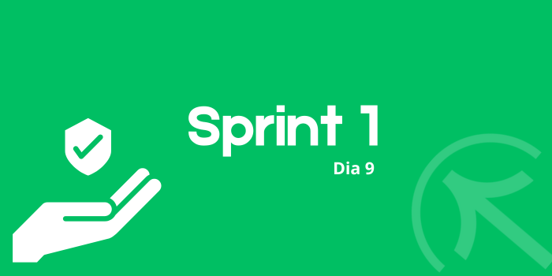

# Sprint 1
## Dia 9 MasterClass

Esse é um arquivo com meus estudos sobre o nono dia Sprint 1 na minha bolsa na [Compass.UOL](https://compass.uol/en/about-us/)

# Assuntos abordados

## Como ser hackeado (ou melhor, como não ser)

> # Dica 1
Ter medo é importante, não se pode ter confiança que estamos sempre seguros, todo cuidado é pouco.
Ser Racional
Choque de gerações onde nem todos têm contato com a tecnologia, cada geração lida com a informação e segurança de maneira diferente.
phishing é uma das principais fontes de ataques hackers
Não clicar em links desconhecidos, principalmente links quebrados
erros de portugues, mensagens urgentes, promoções irreais.
Não colocar dados em sites ou em links suspeitos.

> # Dica 2
Compartilhar wifi pode ser um problema ao compartilhar o wifi de sua residência, pois o IP é seu então a responsabilidade cairá sobre você.
cuidado com redes públicas, poderá colocar em risco suas informações.

> # Dica 3
Cuidados  com seus dados em redes sociais, se suas redes forem abertas, literalmente qualquer pessoa pode ver isso. Postagens compartilhando localização atual. Endereço, foto de sua casa. Perfis fakes. As redes sociais são uma grande fonte de phishing.

> # Dica 4
Nunca use a mesma senha, assim se uma senha for vazada não será a mesma em todos os serviços cadastrados. Empresas grandes sofrem frequentemente com vazamentos, nunca se deve confiar 100% nelas.

> # Dica 5
Comportamentos estranhos no PC, pop up, tela piscando, cmd abrindo.
"A curiosidade matou o gato"

> # Dica 6
Backup é importante, nunca se sabe quando seu computador pode quebrar, ou se seus dados foram sequestrados.(Além de erros pessoais)

"Os alvos são as pessoas e não só os sistemas."

## Novo OWASP TOP 10 - 2021

OWASP (Open Web Application Security Project) é um projeto sem fins lucrativos para melhorar a segurança de software.

## Top 10 (Riscos de segurança)
### 1. Broken Acess Control
### 2. Cryptographic Failures
### 3. Injection
### 4. Insecure Design
### 5. Security Misconfiguration
### 6. Vulnerable and Outdated Components
### 7. Indentication and Authentication Failures
### 8. Software and Data Integrity Failures
### 9. Security Logging and Monitoring Failures
### 10. Server-Side Request Forgery

OWASP API Security
Com o crescente uso de APIs os riscos de segurança aumentam significativamente. O OWASP API Security também consta com seu próprio top 10:

#### 1. Broken Object Level Authorization
#### 2. Broken Authentication
#### 3. Excessive Data Exposure
#### 4. Lack of Resources & Rate Limiting
#### 5. Broken Function Level Authorization
#### 6. Mass Assignment
#### 7. Security Misconfiguration
#### 8. Injection
#### 9. Improper Assets Management
#### 10. Insufficient Logging & Monitoring

As APIS podem envolver falhas de autenticação, e também podem se comunicar com  serviços de terceiros que podem estar comprometidos.

## Segurança de rede Wifi Doméstica

### Sequestros de DNS

### Botnets e Proxy
sequestro de ip, onde o invasor pode usar seu ip

### Monitoramento de tráfego
Com a possibilidade de monitorar os sites que você acessa, e assim podendo roubar dados pessoais ou senhas
### Vazamentos de dados pessoais e senhas
Seus dados podem ser expostos na internet e caírem nas mãos de golpistas e ou outras pessoas maliciosas.

### Como se defender?
Mudar as informações padrão do roteador, usar firewall, atualizar firmware, utilizar WPA2 e AES256, alterar a senha de rede e login de fábrica, bloquear dispositivos desconhecidos, ocultar redes.

### Práticas para o Home-Office
Evitar redes públicas, Usar senhas fortes e não repetidas, Usar antivírus, sempre ter o dispositivo atualizado, alterar senha esporadicamente e nunca compartilhar usuários e senhas.

Lembrando que não são apenas seus dados que estão em riscos mas o da sua empresa também.

## Segurança Digital - Dicas para se proteger o dia-a-dia

## 10 dicas
### Ter uma boa senha
Com letras maiúsculas, minúsculas, caracteres especiais, tenha senha que você possa lembrar, com no mínimo 12 caracteres.
### Use um gerenciador de senhas
não use a mesma senha para tudo, são apps cofre que pode guardar as senhas, onde você pode guardá-las de forma segura.
### mfa all the things
Ter mais de uma maneira de autenticação. É preferível usar um app autenticador do que SMS.
(Usar código de backup para prevenir a perda do acesso do app authenticator)

### Cuidado com Phishing
Cuidado com links suspeitos ou relacionados, não informe dados importantes. E não abrir anexos suspeitos.

### Antivírus
Ter um antivírus, mesmo sendo o padrão do windows, afinal seguindo outras recomendações de segurança ajudam a não depender apenas do antivírus

### Manter o software atualizado
As atualizações corrigem erros e vulnerabilidades.

### Backup
Ter sempre uma maneira de salvar de maneira de salvar seus dados e informações.

### Segurança do Navegador
Usar ADD-ONS para ajudar na segurança.

### Privacidade
Todos os dados informados na internet podem ser vazados. Usar sempre o mínimo de informações necessárias.
### Transações na internet
Usar sempre sites confiáveis, cuidados com fraudes, principalmente em vendas de pessoa física por física. Usar cartão de crédito virtual.

