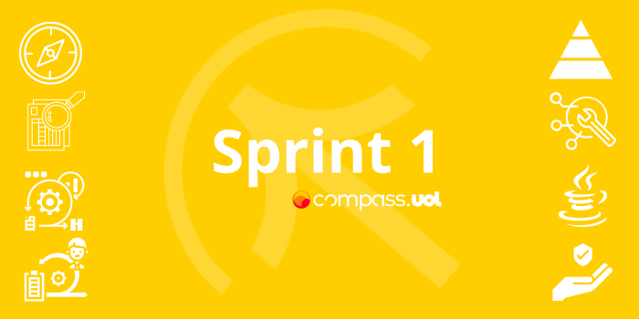

# Sprint 1
Documentação sobre a Sprint 1 da da bolsa de estudos da [Compass.UOL](https://compass.uol/en/about-us/)
A Sprint 1 tem um foco estrutural, ela aborda conceitos básicos para dar uma base aos estudantes que seguiram esse caminho junto a empresa

Os conteúdos abordados nessa Sprint foram:

## 1. Onboard
## 2. Planning Sprint 1
## 3. Scrum, Papéis e responsabilidades
## 4. Fundamentos do teste de software
## 5. Fundamentos do teste de software (Back-End)
## 6. Myers e o princípio de Pareto
## 7. JAVA para iniciantes
## 8. JAVA para iniciantes
## 9. CyberSecurity

