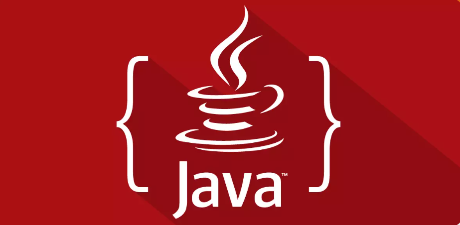

# Sprint 1
## Dia 7 e 8 JAVA

Esse é um arquivo com meus estudos sobre o sétimo e oitavo dia Sprint 1 na minha bolsa na [Compass.UOL](https://compass.uol/en/about-us/)

# Assuntos abordados
Mudança de conteúdos de SQL para JAVA para iniciantes.

A linguagem JAVA como uma grande linguagem de programação está presente na maioria dos aparelhos que interagimos no nosso dia a dia, essa linguagem é muito poderosa e conta com uma comunidade muito grande desenvolvedores, além de grandes bibliotecas de códigos, assim o se torna uma grande alternativa  para desenvolvedores colocarem em prática seus projetos. Ela pode ser usada para uma grande variedade de propósitos, como sistemas, aplicações, servidores, app mobile, big data, automação em testes, entre outros.

Os códigos presentes nessa pasta ( Sprint 1 dia 7-8) são apenas um breve estudo sobre a linguagem. Porém estão longe do total potencial dessa linguagem.

