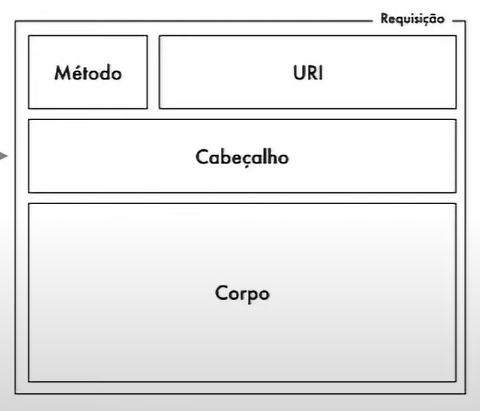
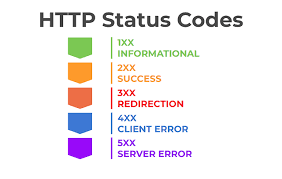

# Sprint 2
## Dia 1 MasterClass

Esse é um arquivo com meus estudos sobre o primeiro dia Sprint 2 na minha bolsa na [Compass.UOL](https://compass.uol/en/about-us/)

# Assuntos abordados

## User Stories & Issues
A plataforma GitLab consta com várias funcionalidades interessantes para o desenvolvimento de e gerenciamento de projetos. Assim é possível ter uma organização maior sobre todo o projeto, pois nele há recursos que auxiliam na no trabalho em equipes, onde funções, tags, listas, assinaturas estão disponíveis para o controle do projeto.
Assim as User Stories podem ser documentadas e a elas atribuídas aos Issues, a organização fica de acordo com a equipe, porém é recomendado usar listas como "To Do", "Doing" e "Review".
Esses boards podem ser ligados a projetos do próprio GitLab.

## Conceitos HTTP, API REST & JSON
O HTTP (Hyper Text Transfer Protocol), é um protocolo de comunicação entre sistemas que é muito importante e usado na web.
Essa troca de informações é feita por clientes que fazem os requests, e a resposta do servidor que é os responses.

As APIs (Application Programming Interface) são importantes para se comunicar com outras plataformas e serviços, as APIs poupam uma série de trabalhos que teriam que ser feitos do zero caso elas não possam ser utilizadas.
As APIs são flexíveis, podem gerir o controle de acessos além de reduzirem o custo do projeto, elas são seguras graças ao controle de acessos e por permitirem que a API tenha acesso apenas em informações relevantes.

### REST vs RESTful

O REST facilita a comunicação entre sistemas, o cliente e o servidor são implementados de forma independente.
O RESTful tem os mesmos princípios do REST, porém a API precisa atender a uma série de requisitos, ela precisa ter mais maturidade.

## cursos de udemy

3 visões importantes na para Exemple Mapping, a visão do PO, do desenvolvedor, visão do testador, cada um pode agregar valor ao produto. Para uma entender uma Historia de usuário é necessário saber o contexto, a ação, e o resultado disso, saber levantar requisitos
historia, regra exemplos  caminho de quando dá certo e o caminho de quando dá errado, questionamentos são parte do processo de produzir algo, não devemos ignorá-los

## Atividade Complementar 1

A importância de Reportar corretamente um bug ou erro é fundamental para um bom entendimento do projeto, afinal é necessário saber o que está errado e porque está errado, para que se possa achar meios de resolver tais problemas, tratar as informações transparentes e acessíveis para um melhor entendimento é a chave para o sucesso. O respeito ao reportar problemas deve sempre estar presente. Quanto mais detalhes forem fornecidos, melhor será a compreensão do problema e a solução adequada poderá ser implementada.

https://gitlab.com/higor_sprints/Sprints/-/boards

## Atividade Complementar 2
### Status code de API REST
Os status code de uma API REST é uma informação preciosa para entender como a aplicação está funcionando, assim podemos ter uma confirmação do resultado da API, como ela pode ter vários resultados é importante saber os codigos desses resultados, eles variam de 1xx até 5xx. cada grupo de códigos tem um significado diferente.

Códigos específicos de REST:

- 200 (OK)
- 201 (Created)
- 202 (Accepted)
- 204 (No Content)
- 301 (Moved Permanently)
- 302 (Found)
- 303 (See Other)
- 304 (Not Modified)
- 307 (Temporary Redirect)
- 400 (Bad Request)
- 401 (Unauthorized)
- 403 (Forbidden)
- 404 (Not Found)
- 405 (Method Not Allowed)
- 406 (Not Acceptable)
- 412 (Precondition Failed)
- 415 (Unsupported Media Type)
- 500 (Internal Server Error)
- 501 (Not Implemented)

