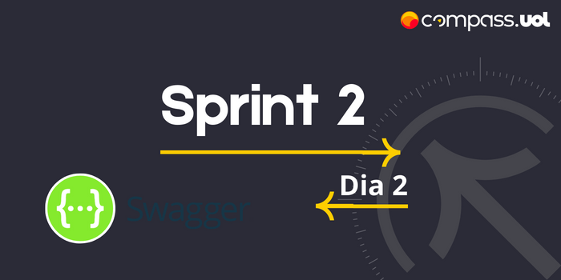
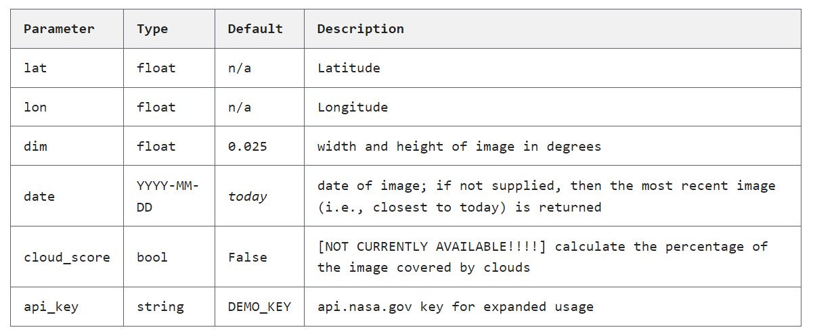

# Sprint 2
## Dia 2 MasterClass

Esse é um arquivo com meus estudos sobre o primeiro dia Sprint 2 na minha bolsa na [Compass.UOL](https://compass.uol/en/about-us/)

# Assuntos abordados

## Testes Estáticos (Swagger)
O [Swagger](https://swagger.io/) é uma ferramenta que auxilia o entendimento, documentação, desenvolvimento, consultas, operações entre outros.
Exemplos de métodos:
POST
PUT
GET
DELETE

### parâmetros
(query) exemplo (https://apiexemplo/ex/?status=exmeplo-de-staus), ou seja o "status" recebeu "exmeplo-de-staus".
(body) exemplo do body, ou seja o json que fica no corpo de sua requisição.

# API estudada
As APIs públicas são muito úteis para estudos, pois permitem o acesso de público em geral, mesmo sendo de fora da organização dona da API, eu estudei a API Earth da NASA, disponivel em https://api.nasa.gov/, a documentação é bem completa e auto explicativa, a função dessa API é retornar uma imagem da terra baseado nas informações fornecidas.

https://api.nasa.gov/planetary/earth/imagery?lon=-95.33&lat=29.78&date=2018-01-01&dim=0.15&api_key=DEMO_KEY

Os parâmetros são lon =-95.33, lat=29.78, date=2018-01-01, dim=0.15, api_key=DEMO_KEY (a chave de acesso da API)

