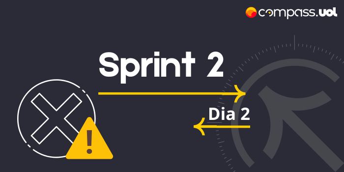
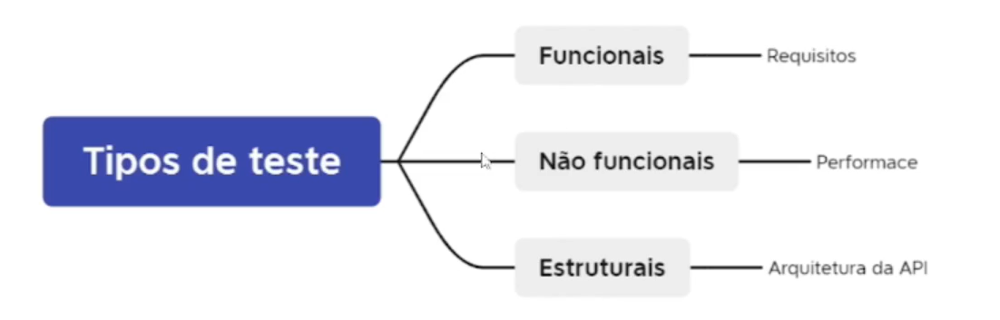
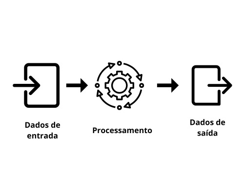

# Sprint 2
## Dia 3 MasterClass
Esse é um arquivo com meus estudos sobre o terceiro dia da  Sprint 2 na minha bolsa na [Compass.UOL](https://compass.uol/en/about-us/)

# Assuntos abordados

## Validações e Boas práticas para testes de APIs
Validar uma API é essencial, pois assim podemos ver se essa API está comprindo com seu papel de maneira esperada, validar métodos e suas respostas, comparar as responses com o resultado esperado, validar o body, header, e tokens. É importante ficar atento aos status de erros.

## Boas práticas para testar APIs
Entender o projeto é fundamental, saber qual o propósito da API, como ela funciona, seu objetivo, com o que ela se relaciona, entender a API é importante para criar estratégias de testes. A documentação é um forte aliado na hora de entender, planejar e testar a API, pois nele constam informações, parâmetros, métricas, códigos, respostas da API, entre outros. **Não se deve ficar preso a documentação da API, pois essa pode não estar completa, e conter possíveis erros, pensar fora da caixa é essencial, devemos pensar na API e na sua integração com o resto do sistema e testar métodos e casos que não constam na documentação da API**

A segurança de API é não deve ser subestimada, não adiante ter uma API funcional e não segura, pois os riscos de que essa falta de segurança podem trazer para o software podem ser devastadores, testar, a autenticação, tokens, usuários, permissões, fluxos de dados entre outros são fundamentais para garantir a integridade da APi.

## Como fazer Testes Funcionais em API Rest?
Saber as regras de negócios, Os testes funcionais servem para validar a função do software, testar as RNs (Regras de Negócios), não se deve ficar preso em entradas óbvias, sempre se deve pensar em possíveis situações que podem ser testadas, mesmo que essas não constem na documentação.

## Tipos de erro (Backend)
quanto mais informações se tiver sobre o sistema melhor é para os testes descobrirem erros

* Gravidade
* Prioridade
* Riscos

Ao achar um erro é muito importante conseguir saber classificar os erros, para que a correção possa ser feita de maneira assertiva, saber como um erro pode alterar a qualidade, segurança, pontualidade e confiança é essencial para o projeto.

A mal Comunicação pode causar erros, uma documentação errada pode causar falhas nos testes.
massa de dados um sistema tem que saber lidar com as cargas de dados,

