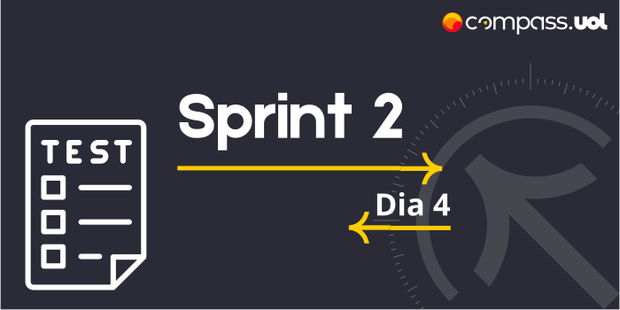

# Sprint 2 
## Dia 4 MasterClass | Planejamento de testes 
Esse é um arquivo com meus estudos sobre o quarto dia da Sprint 2 na minha bolsa na [Compass.UOL](https://compass.uol/en/about-us/)

# Assuntos abordados 📚

## Planejamento de testes

### 👁️‍🗨️ Plano de teste
Planejar os testes são cruciais, o plano de testes não se prende a apenas como o teste será executado, ele ta também abrange uma série de questionamentos, ele é um informativo para deixar claro e transparente todo o processo de teste, nele contém o planejamento, como realizar os teste, atividades a serem realizada, datas, ricos, recursos e outras informações importantes. Um projeto pode ter vários planos de testes para  cada tipo de teste ou aplicação, o plano de teste dá um caminho e um rumo para a equipe.

## Elementos do plano de teste
Um plano de teste pode conter vários tópicos, cada um agrega um conjunto de informações úteis para o plano.

### 1. Título
O título traz um entendimento claro e direto sobre o plano de teste.

### 2. Resumo
O resumo é uma série de informações sobre o plano de teste, nele há hipóteses, contexto os motivos do teste, exemplos e resultados esperados, ele é um resumo das informações do plano de teste.

### 3. Pessoas envolvidas
As pessoas responsáveis e participantes dos testes devem estar descritas no plano, afinal são elas que participaram e serão responsáveis pelos testes e os requisitos dos mesmos, caso usuários sejam convidados a testes o software eles também devem ser listados.

### 4. Funcionalidades ou módulos testados
Informar o que será testado, como também os tipos e níveis de testes, histórias de usuário.

### 5. Local dos testes
Onde que será realizado os testes, será um ambiente específico, ou se será em um ambiente real, uma simulação entre outros.

### 6. Recursos necessários
Tudo o que será necessário para a realização do teste, desde local, softwares, equipamentos, verba, infraestrutura, dados...

### 7. Critérios usados
São dados pertinentes como a quantidade de testes, como será avaliado, a noção de pronto, tarefas feitas, tempo de execução.

### 8. Riscos
É o local de contingência, nele se é estimado possíveis problemas durante os testes, e como se deve agir caso um desses imprevistos venha a acontecer, para assim minimizar ou anular possíveis perdas.

### 9. Como os resultados do teste serão divulgados
Como os dados obtidos serão organizados e encaminhados para a pessoa, equipe ou setor responsável.

### 10. Cronograma
Possui as datas e estimativas que uma atividade será realizada, além do tempo de duração dessa atividade, o cronograma possui as datas de todas as etapas dos testes, desde o planejamento até o resultado final.

## Mapa essencial para teste de software
O planejamento não deve ser subestimado, seu papel para o projeto é fundamental para criar estratégias que possam agregar valor e qualidade no projeto. Apesar de se variar mundo de instituição para instituição recomenda se que um plano de teste tenha:
### 1. Introdução
### 2. Requisitos a serem testados
### 3. Estratégias e ferramentas de teste
### 4. Equipe e infra-estrutura
### 5. Cronograma de atividades
### 6. Documentação complementar

