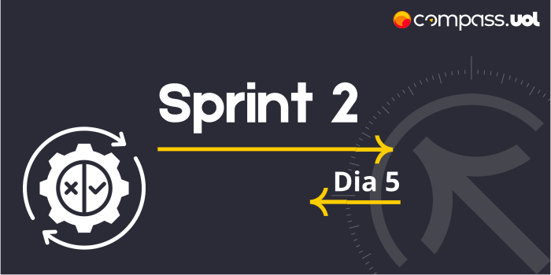

# Sprint 2 
## Dia 5 MasterClass | Cobertura de testes de APIs & Testes candidatos à automação 
Esse é um arquivo com meus estudos sobre o quinto dia da Sprint 2 na minha bolsa na [Compass.UOL](https://compass.uol/en/about-us/)

# Assuntos abordados 📚
Os dados são informações preciosas, em função disso nós, QAs devemos sempre trabalhar para garantir a confiabilidade desses dados.
## Coberturas de testes API
Fluxos de testes, assim com base na documentação da API, podemos seguir caminhos para realizar esse teste de fluxo, existem vários fluxos que devem ser pensados e testados.

## Como medir a Cobertura de Testes de API Rest?
Existem vários tipos de cobertura de testes, desde cobertura de requisitos, riscos, códigos, entre outros. Para medir os testes em APIs REST, é usado o artigo [Test Coverage Criteria for RESTful Web APIs](https://personal.us.es/amarlop/wp-content/uploads/2019/09/Test_Coverage_Criteria_for_RESTful_Web_APIs.pdf) de Martin-Lopes et al.
Cobrir a interface da API REST, analisar os inputs(entradas) e os outputs(saídas),
## Como verificar a cobertura de testes de APIs REST
### Path Coverage (input)
É a cobertura de caminho baseada nos endpoints da API REST, a quantidade de caminhos (URI), às vezes são iguais, porém seus métodos são diferentes, esses contam como um único caminho.
ex:
- GET **/user/{username}**  - **caminho 1**
- PUT **/user/{username}** -  **caminho 1**
- GET **/user/login** -  **caminho 2**

Como a URI (/user/{username}) é igual para GET e PUT, esses são contados como um, e como a URI (/user/login) é diferente de /user/{username}, então temos 2 caminhos.

#### O cálculo
vamos supor que foi testado **apenas o GET /user/{username}**
O cálculo de Path Coverage é feito dividindo os caminhos testados pelo total de caminhos e multiplicando por 100.
ex: 1/2 = 0,5 * 100 = 50 ou 50% de cobertura de teste

### Operator Coverage (input)
É a cobertura de testes baseado nos métodos. Então todos os métodos para cada caminho devem ser testados

- **GET** /user/{username} - **operação 1**
- **PUT** /user/{username} - **operação 2**
- **GET** /user/login - **operação 3**

#### O cálculo
Vamos supor que foi testado **apenas o GET /user/{username}**
O cálculo de Operator Coverage é feito dividindo as operações testadas pelo total de operações e multiplicando por 100.
ex: 1/3 = 0,3333 * 100 = 33.33 ou 33.33% de cobertura de teste

### Parameter Coverage (input)
É a cobertura de testes baseado nos parâmetros em cada método da API REST. diferentes dados podem ser testados nos parâmetros e combinações, mas não são obrigatórios para tem 100% de cobertura.

- GET /user/{username} - **Parâmetro 1** (username* string)
- PUT /user/{username} - **Parâmetro 2** (username* string, body* object)
- GET /user/login - **Parâmetro 3** (username* string, password* string)

#### O cálculo
Vamos supor que foi testado **todos os Parâmetros**.
O cálculo de Parameter Coverage é feito dividindo as operações testadas pelo total de operações e multiplicando por 100.
ex: 3/3 = 1 * 100 = 100 ou 100% de cobertura de teste.
(porém mesmo tendo 100% de cobertura, se foi testado os parâmetros da entrada apenas uma vez, isso **não exclui possíveis erros**, como por exemplo foi testado um usuário com apenas caracteres normais, porém quando um usuário coloca um caracter especial o API não consegue processar a informação corretamente.)

### Parameter Value Coverage (input)
Ele considera os valores comuns para os parâmetros testados.

- GET /user/{username} - **Parameters value 1** (string) (testa os valores comuns para string, como nulo, vazio, caracteres inválidos entre outros.)
- PUT /user/{username} - **Parameters value 2** (string, object)
- GET /user/login - **Parameters value 3** (string, string)

#### O cálculo
Quantidade total de valores diferentes enviados / quantidade total de valores que podem assumir.

### Content-Type Coverage (input e output)
Verifica o content-type sendo exibido em cada endpoint.

- GET /user/{username} - **Content-Type 1** (input) application/json, **Content-Type 2** application/xml
- PUT /user/{username} - **Content-Type 3** (output ou response) application/json, **Content-Type 4** application/xml
- GET /user/login - **Content-Type 5** (output ou response) application/json, **Content-Type 6** application/xml

#### O cálculo
Vamos supor que foi testado os **Content-Type 1, 2, 3, 4**.
O cálculo de Content-Type Coverage é feito dividindo os Content-Type testados pelo total de Content-Type e multiplicando por 100.
ex: 4/6 = 0.6666 * 100 = 66.66 ou 66.66% de cobertura de teste.

## Operation Flow (input)
É a cobertura de fluxos, ou seja a relação entre métodos.

- GET /user/{username}  para  PUT /user/{username} - **fluxo 1**
- GET /user/login  para  GET /user/{username} - **fluxo 2**
- GET /user/login  para  DELETE /user/{username}  - **fluxo 3**

#### O cálculo
Vamos supor que foi testado os **fluxos 1 e 2**.
O cálculo de Operation Flow é feito dividindo os fluxos testados pelo total de fluxos e multiplicando por 100.
ex: 2/3 = 0.6666 * 100 = 66.66 ou 66.66% de cobertura de teste.

### Response Properties Body Coverage (Output)
É o teste referente aos parâmetros no body da resposta. Para testar os parâmetros devemos analisar cada propriedade da resposta.

        GET /user/Maria  
                             {
                                "id": 01,                             propriedade 1
                                "username": "Maria",                  propriedade 2
                                "firstName": "Maria",                 propriedade 3
                                "lastName": "Silva",                  propriedade 4
                                "email": "mariasilva@exemplo.com",    propriedade 5
                                "password": "12345678",               propriedade 6
                                "phone": "+99 (99) 8 8888-88",        propriedade 7
                                "userStatus": 1                       propriedade 8
                             }

        GET /user/João  
                             {
                                "id": 02,                             propriedade 1
                                "username": "João",                   propriedade 2
                                "firstName": "João",                  propriedade 3
                                "lastName": "Santos",                 propriedade 4 (propriedade 5 email faltando)
                                "password": "87654321",               propriedade 6
                                "phone": "+99 (99) 9 9999-99",        propriedade 7
                                "userStatus": 2                       propriedade 8
                             }

#### O cálculo
Vamos supor que foi testado os **GETs de Maria e João**.
Ao analisar os parâmetros pode-se achar que tudo está em ordem, porém ao comparar os parâmetros da Maria com o João vemos que falta o parâmetro 5 "email" então nesse teste não obtivemos 100% de cobertura, pois faltou uma propriedade na resposta do user João.

### Status Code Coverage (Output)
Verifique quais status codes existentes em cada endpoint estão cobertos pelos testes.
- GET /user/{username} - **Status code 1** 200, **Status code 2** 400, **Status code 3** 404.
- PUT /user/{username} - **Status code 4** 400, **Status code 5** 404.
- GET /user/login - **Status code 6** 200, **Status code 7** 400.

#### O cálculo
Vamos supor que foi testado os **Status code de GET /user/{username} e GET /user/login**.
O cálculo de Status Code Coverage é feito dividindo os status code testados pelo total de status code e multiplicando por 100.
ex: 5/7 = 0.7142 * 100 = 71.42 ou 71.42% de cobertura de teste.

## Testes candidatos à automação
Nem todo teste desse será automatizado, como selecionar os testes candidatos a automação?

* Conversar com o cliente para entender quais são as prioridades e os fluxos mais importantes e mais essenciais.
* Riscos, analisar quais partes da aplicação que têm mais impacto na aplicação.
* Tarefas repetitivas.
* Demandas novas não podem ser automatizadas antes que existam testes manuais, pois é preciso ter certeza de que ela está sem bugs.

A automação tem que ser alterada e mudada conforme o andamento e desenvolvimento da aplicação.

### Exemplo de fluxo
Cenários que fazem parte do fluxo de compra:
Ex: Autenticação convencional, adicionar produto da vitrine de produtos, sacola - prosseguir compra.

Podem existir inúmeros fluxos, cada um sendo um conjunto de cenários diferentes.
Os fluxos mais importantes, com mais riscos, e que são testados frequentemente são fortes candidatos a se tornarem automatizados.

