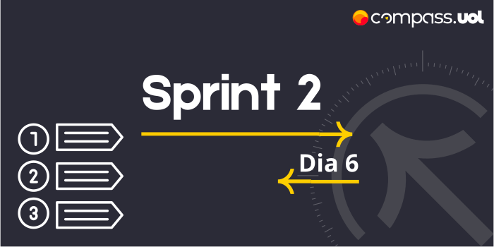
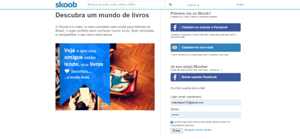
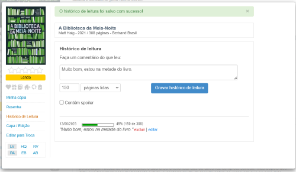
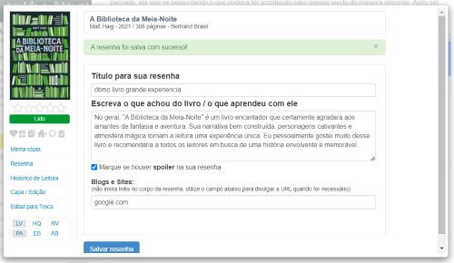

# Sprint 2 
## Dia 6 MasterClass | Introdução às atividades de análise de teste & Priorização em diferentes aplicações 
Esse é um arquivo com meus estudos sobre o sexto dia da Sprint 2 na minha bolsa na [Compass.UOL](https://compass.uol/en/about-us/)

# Assuntos abordados 📚

## Introdução às atividades de análise de teste
Os QA (Quality Assurance) são responsáveis por agregar valor, confiança e qualidade no produto Ele faz a validação do processo.
Saber documentar, analisar e ter uma boa comunicação é fundamental.
responsabilidades

- Ter conhecimento e domínio do projeto;
- Analisar e planejar os testes;
- Executar testes (desde testes unitários até e2e, ele deve realizar todos os testes necessários)
- Analisar os planos de testes, desde seus requisitos até seus riscos
- Analisar e revisar códigos;
- Realizar relatórios com informações e evidências sobre os testes e o produto;
- Automatizar processos;
- Conhecer a infraestrutura;
- Dar feedback e auxílio.

QC (Quality control) responsável por controlar a qualidade do software. Ele faz a validação do produto.

Conhecimentos

* Test-driven development (TDD)
* Behavior Driven Development (BDD)
* Domain Driven Development (DDD)

Ferramentas em Destaque

- LambdaTest
- Testim
- TestBrain
- QA Wolf

- Jenkins
- Selenium
- Cucumber

Ferramentas de comunicação e organização

* Jira
* GitLab

Os QAs tem que ter ótimas habilidades em comunicação e em gestão de projetos, eles devem pensar como usuários, pensar como desenvolvedor e pensar como o cliente.

## Syllabus

O Syllabus é um documento muito importante com conhecimentos e conteúdos para a certificação em  qualidade de software.

## Priorização em diferentes aplicações
Qual o principal objetivo da minha aplicação, pois um fluxo prioritário é essencial para a aplicação funcional, **priorizar não é excluir as outras partes da aplicação, essas também devem ser testadas e analisadas, porém devemos focar nas prioridades**

Pensar no objetivo principal da aplicação
O fluxo abordado bloqueia ou dificulta muito o objetivo dessa aplicação? se a resposta for sim então esse fluxos deve ser priorizado.

objetivo de um E-commerce, fazer vendas.

Tenho que estar logado para comprar? sim, então é prioritário.
Para logar tenho que me cadastrar? sim, então é prioritário.
Para comprar tenho que adicionar um produto na sacola? sim, então é prioritário.
Para comprar tenho que ir à página de iniciativa música? não, então não é prioritário.
Para comprar tenho que entrar em "minha sacola"? sim, então é prioritário.
Para comprar tenho que informar meus dados? sim, então é prioritário.
Para comprar tenho que realizar o pagamento? sim, então é prioritário.

Fluxo prioritário = Logar, adicionar um produto na sacola, acessar minha sacola, informar meus dados, pagar.
(podem existir mais de um fluxo prioritário, como por exemplo adicionar mais um produto na sacola, cadastrar em vez de logar, produto com desconto, produto com frete, entre outros.)

Cada aplicação possui objetivos diferentes, e algumas aplicações podem ter mais de um objetivo principal, e mesmo que os objetivos sejam iguais, o fluxo para realizá-lo pode ser diferente.

Priorização dentro de demandas
Como os testes ocorrem junto de desenvolvimento da aplicação, durantes o desenvolvimento haverá demandas de testes, e é necessário achar quais dos casos da demanda são prioritários, é necessário saber priorizar quando é uma aplicação inteira e quando é uma demanda, pois a prioridade da demanda poder diferente da prioridade da aplicação.

## atividade:

Escolher segmento e aplicação na internet, e criar lista  de fluxos prioritários para a validação.

A aplicação escolhida é o site [Skoob](https://www.skoob.com.br/), Segmento e foco do site é em gerenciamento e rede-social. O Skoob é um site brasileiro onde constam diversas ferramentas para o gerenciamento de leitura, além de integrações sociais para permitir aos usuários verem e compartilharem reviews, estatísticas, comentários entre outros.

Objetivo principal da aplicação, permitir o gerenciamento de compartilhamento de livros.
Com isso em mente vamos criar uma lista de fluxo, em que se deverá gerenciar a leitura de um livro, realizar uma review e postá-la na plataforma.

Para realizar essas ações é necessário estar logado. (é possível se cadastrar ou logar com o Facebook)

Escolher um livro para ler.

Adicionar um livro como "Lendo".

Gerenciar Leitura. ( Gerenciar a leitura não é prioridade do objetivo Social, porém é do objetivo de gerenciamento)

Concluir leitura.

Escrever uma Resenha ( Escrever resenha não seria prioridade na parte de Gerenciamento, Porém ela é na parte social)

Publicar resenha.

### Lista

1. Login - (prioridade do objetivo 1 e 2)
2. Selecionar um livro - (prioridade do objetivo 1 e 2)
3. Marcar livro como "Lendo" - (prioridade do objetivo 1 e 2)
4. Gerenciar a Leitura - (prioridade do objetivo 1)
5. Concluir leitura - (prioridade do objetivo 1 e 2)
6. Escrever resenha - (prioridade do objetivo 2)
7. Publicar resenha - (prioridade do objetivo 2)

### Fluxo

Login > Selecionar um livro > Marcar livro como "Lendo" > Gerenciar a Leitura > Concluir leitura > Escrever resenha > Publicar resenha

Caso se quisesse testar apenas a parte de gerenciamento teria que ser realizada apenas os itens 1, 2, 3, 4 e 5. então não faria sentido priorizar os itens 6 e 7.
A mesma coisa caso se queira testar as partes sociais do site. 1, 2, 3, 5, 6 e 7 o item 4 não é a prioridade nesse caso.

