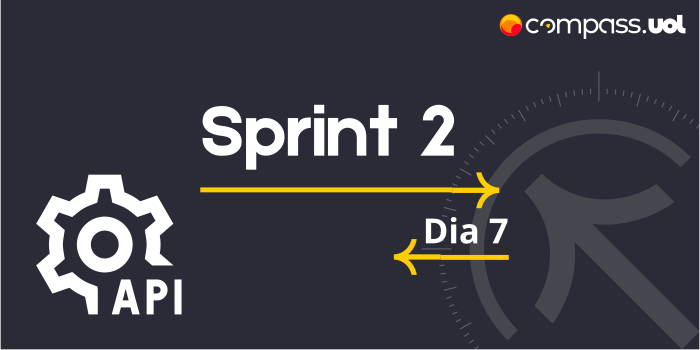
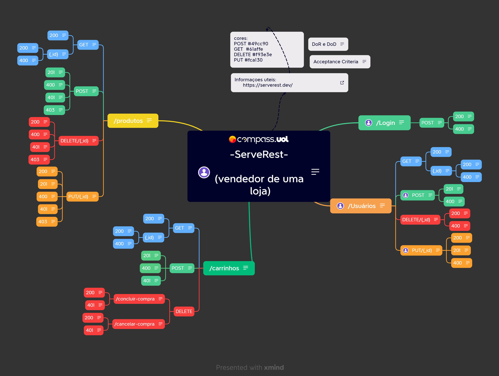

# Sprint 2 
## Dia 7 MasterClass | Análise HTTP e API REST 
Esse é um arquivo com meus estudos sobre o sétimo dia da Sprint 2 na minha bolsa na [Compass.UOL](https://compass.uol/en/about-us/)

# Assuntos abordados 📚

## Análise HTTP e API REST

* Como usar a documentação de uma API para criar cenários de testes.
* Sempre considerar o que está faltando na documentação.
* Os testes devem seguir fluxos que testam as regras e funções da aplicação.

## Mapa mental API

Criar um mapa mental é bom para o planejamento, usando a documentação como base para o nosso mapa mental, é importante não se prender totalmente na documentação pois alguma informação pode estar faltando e cabe a nós testá-la. será usada a ferramenta X Mind para  realizar os mapas mentais. O mapa mental irá dar um rumo para o planejamento dos testes, como ele é editável é possível ter as mesmas informações do Swagger e ainda adicionar anotações, dados, testes entre outros.
Mapear uma aplicação é importante para entender suas funcionalidades e relações entre elas.

