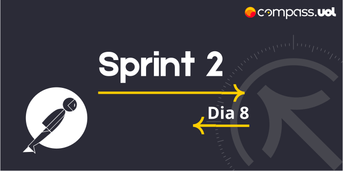

# Sprint 2 
## Dia 8 MasterClass | Introdução ao Postman 
Esse é um arquivo com meus estudos sobre o oitavo dia da Sprint 2 na minha bolsa na [Compass.UOL](https://compass.uol/en/about-us/)


# Assuntos abordados 📚

## Ferramentas para testar API
As ferramentas auxiliam a nossa vida como QAs.


Ferramentas para testes manuais.

* Postman
* Insomnia


Ferramentas  para teste automatizado

* REST-assured
* HTTParty


Ferramental para teste de carga

* Apache JMeter
* K6


## Testes de API com Postman
O Postman contém uma série de funcionalidades extremamente úteis para se trabalhar com APIs, ele aceita chamadas REST, SOAP ou HTTP, salva informações na nuvem, Permite criar e organizar arquivos para otimizar o trabalho além de uma grande série de funcionalidades técnicas.


## Atividade

# 1. Crie uma requisição Get para validar o retorno de usuários através da API;

GET http://localhost:3000/usuarios

body = none


----------------Response----------------
---------------
Status = 200 OK
---------------

```json
{
    "quantidade": 4,
    "usuarios": [
        {
            "nome": "Fulano da Silva",
            "email": "fulano@qa.com",
            "password": "teste",
            "administrador": "true",
            "_id": "0uxuPY0cbmQhpEz1"
        },
        {
            "nome": "Higor Milani",
            "email": "higor@qa.com",
            "password": "123123",
            "administrador": "true",
            "_id": "L8dS4wzqzSOWbmJe"
        },
        {
            "nome": "Teste",
            "email": "tt@t.com",
            "password": "123123",
            "administrador": "true",
            "_id": "ojFsLdhwJwcCuLE9"
        }
    ]
}
```


# 2. Crie uma requisição Post para cadastrar um novo usuário através da API;

POST http://localhost:3000/usuarios

Body:

```json
{
  "nome": "ExDia8 da Silva",
  "email": "exdia8@ex.com",
  "password": "senhaTeste",
  "administrador": "true"
}
```


----------------Response----------------
-----------
201 Created
-----------

```json
{
    "message": "Cadastro realizado com sucesso",
    "_id": "eBReFpqVrivjprIu"
}
```


# 3. Crie uma requisição Get para validar o retorno de um usuário apenas através da API (pode utilizar os IDs dos usuários que vocês irão criar);

GET http://localhost:3000/usuarios/eBReFpqVrivjprIu

body = none


----------------Response----------------
------
200 OK
------

```json
{
    "nome": "ExDia8 da Silva",
    "email": "exdia8@ex.com",
    "password": "senhaTeste",
    "administrador": "true",
    "_id": "eBReFpqVrivjprIu"
}
```


# 4. Crie cenários alternativos no cadastro de usuários, explore possíveis erros que podem ocorrer e mapeie as requisições através do Postman;

POST http://localhost:3000/usuarios - (Cadastro repetido)

Body:

```Json
{
  "nome": "ExDia8 da Silva",
  "email": "exdia8@ex.com",
  "password": "senhaTeste",
  "administrador": "true"
}
```


----------------Response----------------
---------------
400 Bad Request
---------------

```json
{
    "message": "Este email já está sendo usado"
}
```

-----------------------------------------


POST http://localhost:3000/usuarios - (email faltando)

body:

```json
{
  "nome": "Sem email da Silva",
  "password": "senhaTeste1",
  "administrador": "true"
}
```


----------------Response----------------
---------------
400 Bad Request
---------------

```json
{
    "email": "email é obrigatório"
}
```

-----------------------------------------


POST http://localhost:3000/usuarios - (Nome em branco)

body:

```json
{
  "nome": " ",
  "email": "comsenha@qa.com",
  "password": "senhaTeste",
  "administrador": "true"
}
```


----------------Response----------------
-----------
201 Created
-----------

```json
{
    "message": "Cadastro realizado com sucesso",
    "_id": "LwqSpMJJnMG5wn3l"
}
```


# 5. Crie cenários alternativos na atualização de usuários, explore possíveis erros que podem ocorrer e mapeie as requisições através do Postman;

PUT http://localhost:3000/usuarios/0uxuPY0cbmQhpEz1 - (Editando um usuario com id padrão)

Body:

```json
{
  "nome": "Comnome da Silva",
  "email": "comsenha@qa.com",
  "password": "senhaTeste",
  "administrador": "true"
}
```


----------------Response----------------
---------------
400 Bad Request
---------------

```json
{
    "message": "Este email já está sendo usado"
}
```

-----------------------------------------


PUT http://localhost:3000/usuarios/LwqSpMJJnMG5wn3l - (Com o ID correto)

Body:

```json
{
  "nome": "Comnome da Silva",
  "email": "comsenha@qa.com",
  "password": "senhaTeste",
  "administrador": "true"
}
```


----------------Response----------------
------
200 OK
------

```json
{
    "message": "Registro alterado com sucesso"
}
```

-----------------------------------------


PUT http://localhost:3000/usuarios/LwqSpMJJnMG5wn3l (Mudar informaçoes para em branco)

Body:

```json
{
  "nome": " ",
  "email": " ",
  "password": " ",
  "administrador": " "
}
```

----------------Response----------------
---------------
400 Bad Request
---------------

```json
{
    "email": "email deve ser um email válido",
    "administrador": "administrador deve ser 'true' ou 'false'"
}
```


# 6. Crie cenários alternativos na exclusão de usuários, explore possíveis erros que podem ocorrer e mapeie as requisições através do Postman.

DELETE http://localhost:3000/usuarios/ojFsLdhwJwcCuLE9 (Excluir usuario sem carrinho)

Body = none


----------------Response----------------
------
200 OK
------

```json
{
    "message": "Registro excluído com sucesso"
}
```

-----------------------------------------


DELETE http://localhost:3000/usuarios/hgFGkiç9JJGknbdW5 (Excluir usuario inesistente)

Body = none


----------------Response----------------
------
200 OK
------

```json
{
    "message": "Nenhum registro excluído"
}
```

-----------------------------------------


DELETE http://localhost:3000/usuarios/VDUswLgs6ZQtkNdW (Usuario com carrinho)

Body = none


----------------Response----------------
---------------
400 Bad Request
---------------

```json
{
    "message": "Não é permitido excluir usuário com carrinho cadastrado",
    "idCarrinho": "2kp6nRdIeBF4Teku"
}
```


