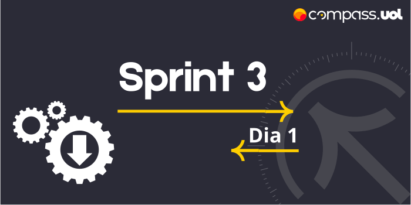

# Sprint 3 
## Dia 1 Ágil | Planning Sprint 3 
Esse é um arquivo com meus estudos sobre o primeiro dia da Sprint 3 na minha bolsa na [Compass.UOL](https://compass.uol/en/about-us/)

# Assuntos abordados 📚
Informações gerais sobre o caminho da sprint e do Challenge.

## Discussão sobre o Challenge
## Configurar o ambiente de desenvolvimento
### Ferramentas utilizadas
- [JDK 20.0.1](https://www.oracle.com/news/announcement/oracle-releases-java-20-2023-03-21/)
- [Maven](https://maven.apache.org/)
- [Eclipse](https://www.eclipse.org/) (ou outra IDE do agrado)
- [Project Lombok](https://projectlombok.org/)
- [Node.js](https://nodejs.org/en)
- [API ServeRest](https://github.com/ServeRest/ServeRest)

