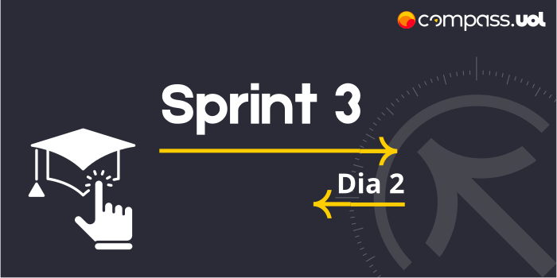

# Sprint 3 
## Dia 2 MasterClass | Planejamento Automação 
Esse é um arquivo com meus estudos sobre o segundo dia da Sprint 3 na minha bolsa na [Compass.UOL](https://compass.uol/en/about-us/)

# Assuntos abordados 📚
Script de automação por JAVA
## Curso Testando API Rest com REST-assured
Curso cobrindo diversas funcionalidades que o Java Rest-Assured e o Junit podem proporcionar para permitir testes e a automatização dos mesmos.

