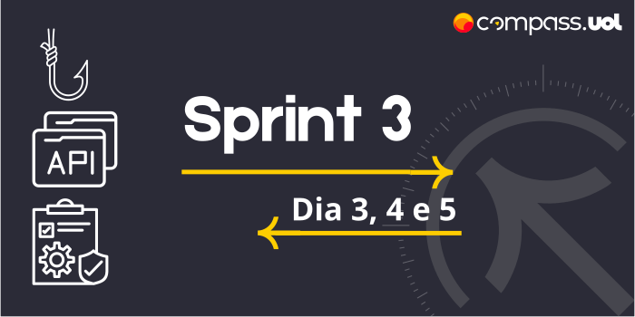

# Sprint 3 
## Dia 3, 4 e 5 MasterClass | Introdução ao RestAssured, Testes com diferentes verbos e Testes com diferentes verbos + Hooks 
Esse é um arquivo com meus estudos sobre o terceiro, quarto e quinto dia da Sprint 3 na minha bolsa na [Compass.UOL](https://compass.uol/en/about-us/)

# Assuntos abordados 📚

## Java RestAssured
É uma linguagem DLS, focada em testes para APIs Rests dando um facilidade para chamadas e validações para testar as APIs usando Java. A grande vantagem de usar o RestAssured é a possibilidade e praticidade de colaboração entre pessoas, já que os testes são códigos que podem ser usados por qualquer um além de ser mais fácil de fazer mudanças e manutenções.

Com o Java RestAssured, e seus frameworks é realizar testes, Usando @Test, given, when, then entre outros.

Mapa Mental

