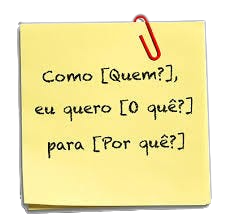

# Sprint 4 
## Dia 2 Masterclass | DoR, DoD & Acceptance Criteria 
Esse é um arquivo com meus estudos sobre o segundo dia da Sprint 4 na minha bolsa na [Compass.UOL](https://compass.uol/en/about-us/)

# Assuntos abordados 📚

TER O CICLO DE TESTES 
## User Stories
Uma User Story é uma descrissão de uma funcionalidade que agregue para o objetivo da aplicção a ser desenvolvida, é o que o cliente quer que a alicação faça, uma aplicação pode ter diversas User stories e cada uma é diferente e independente, uma User Storie deve caber em uma Sprint, ou seja seu ela deve ser estimavel, ela deve ser sujeita a mudanças e deve ser testada para garantir que ela foi feita de forma correta, segura e funcional.

As User Stories são:

- Independentes
- Negociáveis
- Valiosas
- Estimáveis
- Pequenas
- Testáveis

## DoR (Defintion of Ready)
É o consenso entre o time de desenvolvimento e o PO, é importante que ambos os lados tenham os mesma definição de "Ready", essa definição é sobre o nivel de detalhamento e de informaçoes de cada item do backlog, assim aumentando a transparencia e diminuindo o risco de mal entendidos que podegem gerar retrabalhos futuros.

## DoD (Definition of Done)
É o consenso entre o time de desenvolvimento, essa definição vale para as atividades e funcionalidades que serão incrementadas. Esse entendimento pode ser uma serie de verificaçoes que dizem se algo está pronto ou não, esse consenso é essencial pois diz ao desenvolvedor e para as demais pessoas quando algo está pronto.

## Acceptance Criteria
É uma lista de criterios vinculada a uma User Story, ou seja esses criterios serão diferentes para cada nova User Story, essa lista traz informaçoes importantes sobre a US, com ela todos tem um entendimento melhor sobre o produto, eles são regras simples e independentes que dizem o que se deve ter e o que não se deve ter. Os testardores podem planejar seus testes com ela, os desenvolvedores podem adicionar funcionalidades com ela e o PO pode achar caminhos para agregar valor ao produto e ao cliente.

## Atividade

US 001 [API [Earth](https://api.nasa.gov/)] Pesquisa

Como um usuario da API eu gostaria de poder obter uma lista com as fotos e seus dados para eu poder ter acesso a quais dias possuem fotos na localização pesquisada.

DoR
- Banco de dados e infraestrutura para desenvolvimento disponibilizados
- Banco de dados com os dados e fotos disponibilizados
- API já desenvolvida
- Ambiente de testes dizponibilizado

DoD

- Nova rota GET criada
- Nova rota devidamente testada
- Os dados das responses são precisos
- Testes automatizados desenvolvidos

Acceptance Criteria

- Ao não informar o quary "date" deve-se obter a lista com as datas que possuem fotos tiradas naquela localização
- Os links das fotos deve aparecer junto de suas datas
- As responses tem que estar em Json
- Caso não haja nenuma foto na cordenada informada a mensagaem "Não há fotos para a localização informada" deve ser retornada
- As fotos devem ser do local informado no query "lon" e "lat"
- O query "api_key" deve ser valido
- Não deve ser possivel obter a lista de dados sem informar uma key ou ao informar uma key invalida

