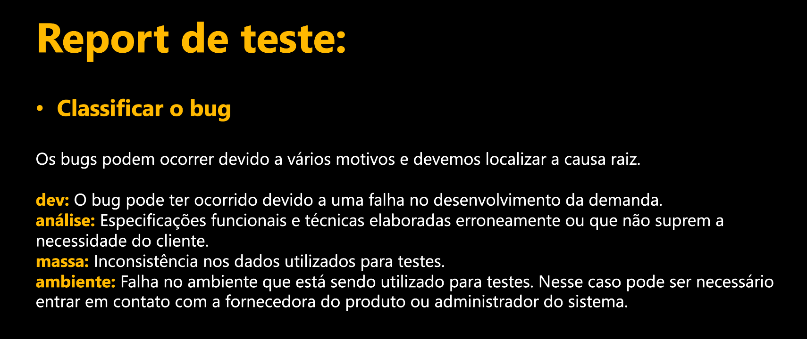

# Sprint 4 
## Dia 3 Masterclass | Gestão de Issues 
Esse é um arquivo com meus estudos sobre o terceiro dia da Sprint 4 na minha bolsa na [Compass.UOL](https://compass.uol/en/about-us/)

# Assuntos abordados 📚

## Como criar issues?
Usando o software [Jira](https://www.atlassian.com/br/software/jira), é possivel ter um controle maior sobre todo o processo de desenvolvimento e teste da aplicação a ser trabalhada, alem de controle de epics, user stories, bugs, issues de aceitação, cronograma entre outros.

- Bug: problema aberto pela empresa
- Issue de aceitação: problema aberto pelo cliente

A distinção entre bugs e melhorias são importantes, tanto no quesito de prioridade e de como ela afeta a aplicação em questão, um bug é um erro e é algo que afeta diretamente a aplicação causando resultados inesperados, enquanto as melhrias são sugestoes que podem trazes beneficioas para a aplicação, elas são adicoes e não correçoes.

### Status de execução de um caso de teste
- Aberto (Teste ainda não executado)
- Em execução
- Passou
- Falhou (Reportar)
- Bloqueado (Uma força externa esta impedindo o teste de acontecer como por exemplo é necessario ter dados do cliente mas ele ainda não forneceu eles)
- Cancelado 

