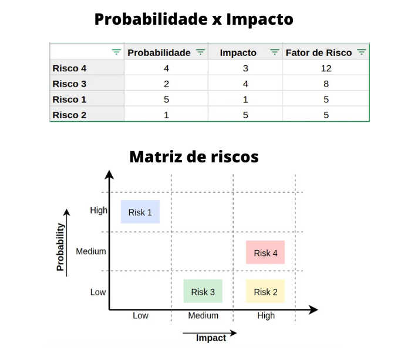

# Sprint 4 
## Dia 4 Masterclass | Gerenciamento, Ciclos e Reports de testes 
Esse é um arquivo com meus estudos sobre o quarto dia da Sprint 4 na minha bolsa na [Compass.UOL](https://compass.uol/en/about-us/)

# Assuntos abordados 📚

## Imporando as Issues do GitLab para o Jira Software

## Análises de Riscos em Testes de Software com PRISMA

Deve-se sempre priorizar as partes mais importantes de seu software, identificar riscos são importantes pois eles podem trazer sérios problemas para a aplicação.
Compartilhar sua visão sobre possíveis problemas com desenvolvedores e outros QAs, para trazer visões diferentes para nossos cenários de testes. Uma aplicação nunca está livre de erros. Os cenários de testes devem ser pensados no contexto da aplicação, as prioridades da aplicação A são diferentes das prioridades da aplicação B.

Saber a prioridade dos testes
problemas críticos devem ser resolvidos antes dos bugs não críticos.

good enough (bach,97)

## Testes Baseados em Riscos

Saber o histórico da aplicação é muito importante, pois ela diz muito sobre os testes que devem ser feitos, saber quais são as funcionalidades mais importantes, aquelas que há mais reclamações dos usuários, são lugares onde pode haver mais riscos, e são esses lugares que devem receber uma atenção especial.

Analisar como uma funcionalidade do sistema influencia nas demais partes "O que aconteceria com a aplicação se essa funcionalidade parasse de funcionar?" Esses pensamentos são importantes para a análise da aplicação como um todo.

Após reunir os riscos de possíveis problemas futuros deve-se uni-los pela prioridade, existem várias formas de fazer essa priorização, dessa forma fica a critério do time da empresa em questão.

### Probabilidade x Impacto
Podem ser usados Probabilidade x Impacto, onde são atribuídos valores de 1 a 5 para a probabilidade deles ocorrerem e para o impacto que eles vão gerar, após isso é multiplicado ambas as notas a assim obtido o fator de risco.

### Matriz de riscos
Nela é realizada uma Matriz com o nível de probabilidade e impacto, baixo (low), médio (medium) e alto (high)  para saber qual tem o maior fator de risco.
Como ela é uma ferramenta visual, ela acaba sendo uma ótima escolha para ter um quadro em que todos podem ver de maneira simples e compreensível os níveis e prioridades dos riscos, direcionando o trabalho necessário para lidar com eles. A matriz pode ser expandida para incluir tanto os riscos negativos (ameaças) quanto os positivos (oportunidades).

Após isso deve-se criar estratégias para diminuir esses riscos, o plano deve sempre focar nos maiores riscos, essas estratégias sempre irão depender do contexto, mas nela podem ter as técnicas utilizadas, os casos de testes, negociar o aumento de prazo de entrega do produto para garantir que esses riscos tenham sido corrigidos entre outros.
Os riscos podem ser medidos e são conhecidos, ao contrário das incertezas, que são problemas que não podem são medidos de maneira precisa, a ideia é transformar essa incertezas em algo conhecido pelo time.

Os testes baseados em riscos podem ser bons para times tradicionais e ágeis.

Como qualquer outro método, essa maneira de trabalhar tem suas vantagens e desvantagens e cabe ao time decidir se isso vai ser bom ou ruim para seu projeto.

## Fases do ciclo dos testes de software

1. Fase
> Análise e validação  
>> Requisitos claros  
>> Sejam testáveis    
>> Estratégia para teste

2. Fase
> Planejamento de Testes  
>> Ordem de execução  
>> Entregas do desenvolvimento  
>> Dependência de testes  

3. Fase
> Design/Modelagem de Testes  
>> Passos de execução  
>> Automatizar ou não  
>> Ordem de execução  

4. Fase
> Ambiente  
>> Hardware  
>> Software  
>> Requisitos  
>> Responsáveis  

5. Fase
> Execução  
>> Documentação  
>> Casos de testes  
>> Preparação de ambiente  

6. Fase
> Reporte  
>> Enviar resultados  
>> Problemas encontrados  
>> O que não foi executado  

## O novo ciclo dos testes de software
O ciclo de vida dos testes é muito importante, afinal os testes acompanham o desenvolvimento dos sites, muitas vezes os testes são planejados antes mesmo da aplicação ser desenvolvida, às metodologia ágil traz inúmeros benefícios, pois os testes não ficam separados em uma etapa diferente como era no modelo waterfall.

## Gestão do ciclo de vida dos testes
Conforme se for desenvolvendo o software, ele deve ser testado, assim seguindo uma linha paralela com os testes. gerir o ciclo de testes é importante para  garantir que a qualidade sempre esteja presente em cada ciclo. ciclo menores podem preencher lacunas e antecipar possíveis problemas.

