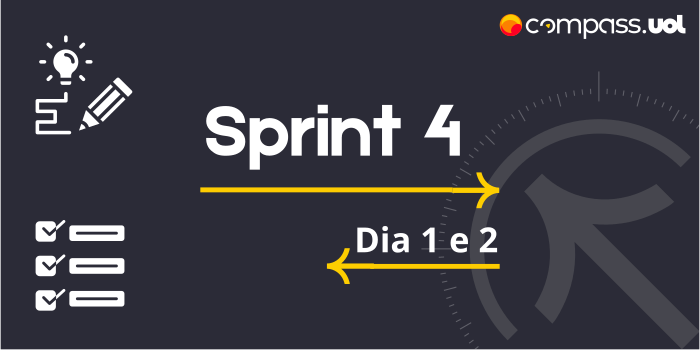

# Sprint 5 
## Dia 1, Ágil e Masterclass | Validação JSON Schema 
Esse é um arquivo com meus estudos sobre o primeiro dia da Sprint 5 na minha bolsa na [Compass.UOL](https://compass.uol/en/about-us/)

# Assuntos abordados 📚

## Informações gerais sobre a Sprint

## Json Schema
O [Json Schema](https://jsonschema.net/) é um otimo metodo para validar a estrutura de um Json.

